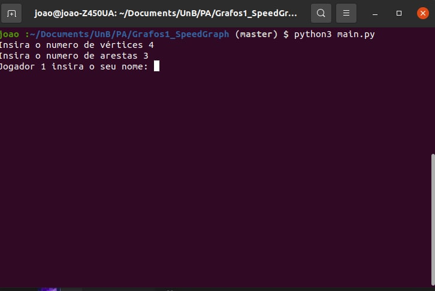
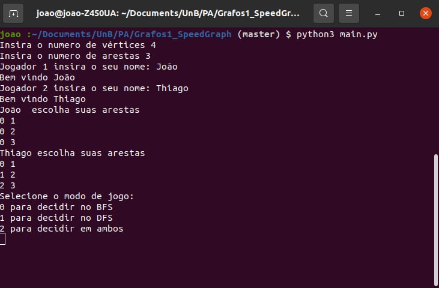
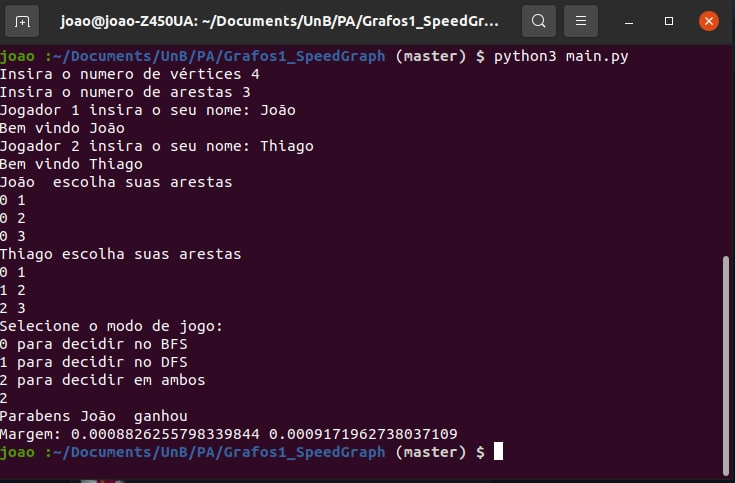

# SpeedGraph

**Número da Lista**: 1 
**Conteúdo da Disciplina**: Grafos 1 

## Alunos
|Matrícula | Aluno |
| -- | -- |
| 18/0028324  |  Thiago Luiz de Souza Gomes |
| 18/0033743  |  João Pedro Silva de Carvalho |

## Sobre 
Link da [apresentação](https://youtu.be/WYPGSKC2Hhk)

## Screenshots

 

 

 

## Instalação 
**Linguagem**: Python 
Baixar python3.5 ou mais nova 

## Uso 
Rodar o comando python3 main.py no terminal.

## Outros 
Quaisquer outras informações sobre seu projeto podem ser descritas abaixo.

